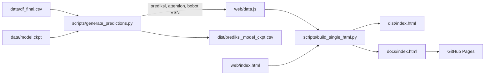

# Memprediksi Saham Energi di Tengah Transisi

**Web story interaktif untuk skripsi** *Prediksi Harga Saham Sektor Energi dalam Transisi Energi Baru Terbarukan Menggunakan Temporal Fusion Transformer Berbasis Technical Indicator dan Sentimen Berita*.

[](https://USERNAME.github.io/web-story-skripsi/)


Web story ini menyajikan hasil penelitian tentang prediksi harga penutupan saham PT Alamtri Resources Indonesia Tbk (ADRO) dalam bentuk narasi interaktif, dari latar belakang hingga kesimpulan. Seluruh grafik prediksi dihitung langsung dari model terbaik penelitian (`model.ckpt`) dan diverifikasi terhadap metadata model.

**Demo daring:** https://USERNAME.github.io/web-story-skripsi/


---

## Daftar isi

- [Fitur](#fitur)
- [Tangkapan layar](#tangkapan-layar)
- [Ringkasan penelitian](#ringkasan-penelitian)
- [Hasil utama](#hasil-utama)
- [Verifikasi model](#verifikasi-model)
- [Arsitektur](#arsitektur)
- [Menjalankan secara lokal](#menjalankan-secara-lokal)
- [Struktur proyek](#struktur-proyek)
- [Deploy ke GitHub Pages](#deploy-ke-github-pages)
- [Keterbatasan dan penafian](#keterbatasan-dan-penafian)
- [Sitasi](#sitasi)
- [Penulis](#penulis)

---

## Fitur

- **Scrollytelling tujuh bagian** yang mengikuti struktur skripsi: latar belakang, rumusan masalah dan tujuan, analisis sentimen, pemodelan TFT, validasi walk-forward, hasil prediksi, serta kesimpulan dan saran.
- **Penjelajah prediksi**: 2.404 prediksi harga penutupan satu hari ke depan. Pengguna dapat memilih rentang waktu, dan RMSE, MAPE, MASE, serta akurasi arah dihitung otomatis. Zona latih, validasi, dan uji ditandai pada grafik.
- **Bedah satu prediksi**: bobot attention model untuk 30 hari masukan dan bobot Variable Selection Network untuk setiap variabel.
- **Matriks 12 konfigurasi** yang dapat diklik dan **diagram walk-forward 10 fold**.
- **Satu file HTML mandiri**: tanpa server dan tanpa basis data, responsif untuk desktop dan ponsel, serta mendukung mode terang dan gelap.

## Tangkapan layar

| Rumusan masalah dan tujuan | Penjelajah prediksi |
|---|---|
|  |  |


## Ringkasan penelitian

| Komponen | Keterangan |
|---|---|
| Objek | Harga penutupan harian ADRO.JK, 2016–2025 (2.464 hari perdagangan) |
| Berita | 303.257 artikel detikFinance, disaring menjadi 36.960 artikel relevan melalui validasi 18 kata kunci |
| Sentimen | Perbandingan dua alur kerja: VADER (teks terjemahan) dan FinBERT-Indonesia (teks sumber), enam uji keterkaitan |
| Model | Temporal Fusion Transformer, desain faktorial 3 aktivasi × 2 inisialisasi × 2 strategi pruning = 12 konfigurasi |
| Optimasi | Optuna (TPE), 240 trial per konfigurasi, objektif rata-rata RMSE validasi |
| Validasi | Walk-forward jendela ekspansif, 10 fold, horizon satu hari |
| Evaluasi | RMSE, MAPE, sMAPE, MASE, akurasi arah, uji residu, dan kontribusi variabel |

## Hasil utama

| Aspek | Hasil |
|---|---|
| Alur sentimen terpilih | VADER, unggul pada 4 dari 6 pengujian |
| Konfigurasi terbaik | K5: ReLU + Kaiming, tanpa pruning |
| RMSE / MAPE uji (rata-rata 10 fold) | 102,70 / 3,15% |
| Fold terbaik (model pada web story) | Fold 6: RMSE 44,77; MAPE 1,48% |
| Kontribusi variabel | Harga penutupan 48,10%; sentimen 8,56% |
| Akurasi arah | Rata-rata 47,97%, setara tebakan acak |

Aktivasi dan inisialisasi terbukti berinteraksi: Kaiming selalu lebih baik, tetapi selisihnya hanya 1,29 poin RMSE pada ELU dan 21,11 poin pada GELU. Strategi pruning tidak berpengaruh sistematis terhadap akurasi.

## Verifikasi model

Prediksi dihitung ulang dari `model.ckpt` dengan implementasi NumPy (`scripts/tft_numpy.py`), sehingga web story dapat dibangun tanpa PyTorch. Hasilnya dicocokkan dengan metadata model pada data uji fold 6:

| Metrik uji fold 6 | Metadata model | Hasil web story |
|---|---|---|
| RMSE | 44,7711 | 44,8036 |
| MAPE (%) | 1,4825 | 1,4842 |
| sMAPE (%) | 1,4723 | 1,4763 |
| MASE | 0,9911 | 0,9917 |

Selisih di bawah 0,1% berasal dari perbedaan presisi float32 (PyTorch) dan float64 (NumPy). Pembanding dengan pytorch-forecasting tersedia di `scripts/generate_predictions_torch.py`.

## Arsitektur



Inferensi model dijalankan sekali secara offline. Halaman web hanya membaca hasilnya, sehingga dapat di-hosting di layanan statis mana pun.

## Menjalankan secara lokal

Prasyarat: Python 3.10 atau lebih baru.

```bash
python -m venv .venv
source .venv/bin/activate        # Windows: .venv\Scripts\activate
pip install -r requirements.txt  # hanya numpy dan pandas

python scripts/generate_predictions.py   # prediksi, verifikasi, dan web/data.js
python scripts/build_single_html.py      # dist/index.html dan docs/index.html
```

Buka `dist/index.html` di peramban. Untuk mengedit halaman, jalankan server lokal agar `web/data.js` terbaca:

```bash
cd web && python -m http.server 8000   # buka http://localhost:8000
```

Panduan lengkap setiap langkah tersedia di [docs/PANDUAN.md](docs/PANDUAN.md).

## Struktur proyek

```
web-story-skripsi/
├── data/
│   ├── df_final.csv              # harga, indikator teknikal, dan skor sentimen VADER
│   ├── model.ckpt                # checkpoint TFT K5 fold 6
│   ├── model_metadata.json       # metrik acuan untuk verifikasi
│   └── encoder_history.csv       # 30 hari encoder terakhir
├── scripts/
│   ├── ckpt_reader.py            # membaca checkpoint tanpa PyTorch
│   ├── tft_numpy.py              # forward pass TFT versi NumPy
│   ├── generate_predictions.py   # prediksi + verifikasi + ekspor data
│   ├── generate_predictions_torch.py  # pembanding pytorch-forecasting (opsional)
│   ├── build_single_html.py      # menggabungkan halaman menjadi satu file
│   └── patch_text_skripsi.py     # teks setiap bagian, selaras dengan Bab I–V
├── web/
│   ├── index.html                # sumber halaman (HTML, CSS, JavaScript, D3.js)
│   └── data.js                   # data hasil generate_predictions.py
├── dist/
│   ├── index.html                # versi satu file untuk unggah manual
│   └── prediksi_model_ckpt.csv   # tabel aktual vs prediksi
├── docs/
│   ├── index.html                # versi satu file untuk GitHub Pages
│   ├── PANDUAN.md                # panduan langkah demi langkah
│   └── img/                      # tangkapan layar README
├── CITATION.cff
├── requirements.txt
└── README.md
```

## Deploy ke GitHub Pages

1. Unggah seluruh isi folder ini ke repositori GitHub.
2. Buka **Settings → Pages**, pilih **Deploy from a branch**, branch `main`, folder `/docs`, lalu simpan.
3. Setelah satu sampai dua menit, situs tersedia di `https://<username>.github.io/<nama-repositori>/`.

Setiap kali halaman diubah, jalankan ulang `python scripts/build_single_html.py`, lalu unggah `docs/index.html` yang baru.

## Keterbatasan dan penafian

- **Bukan rekomendasi investasi.** Web story ini adalah luaran penelitian akademik.
- Model memprediksi **level harga satu hari ke depan**. Akurasi arahnya setara tebakan acak, dan MASE rata-rata 10 fold (2,4455) belum mengungguli tebakan naif.
- Model fold 6 dilatih dengan data hingga Januari 2024. Prediksi setelah periode uji dibuat tanpa pelatihan ulang, sehingga galatnya membesar, terutama setelah penyesuaian harga akibat aksi korporasi pada November 2024.
- Bobot attention dan Variable Selection Network menunjukkan alokasi perhatian model, bukan hubungan sebab-akibat.

## Sitasi

Jika merujuk proyek ini, mohon kutip skripsinya:

> Widodo, W. S. (2026). *Prediksi Harga Saham Sektor Energi dalam Transisi Energi Baru Terbarukan Menggunakan Temporal Fusion Transformer Berbasis Technical Indicator dan Sentimen Berita* [Skripsi]. Politeknik Statistika STIS.

```bibtex
@thesis{widodo2026prediksi,
  author      = {Widodo, Wahyu Satrio},
  title       = {Prediksi Harga Saham Sektor Energi dalam Transisi Energi Baru Terbarukan
                 Menggunakan Temporal Fusion Transformer Berbasis Technical Indicator
                 dan Sentimen Berita},
  type        = {Skripsi},
  institution = {Politeknik Statistika STIS},
  year        = {2026}
}
```

## Penulis

**Wahyu Satrio Widodo** (NIM 222212911)
D-IV Komputasi Statistik, peminatan Sains Data, Politeknik Statistika STIS

Dosen pembimbing: Dr. Robert Kurniawan, SST, M.Si.

Data harga bersumber dari Yahoo Finance dan skor sentimen diturunkan dari artikel detikFinance; hak atas sumber data tetap pada pemiliknya masing-masing. Pemodelan memakai [pytorch-forecasting](https://github.com/sktime/pytorch-forecasting) dan visualisasi memakai [D3.js](https://d3js.org/).

© 2026 Wahyu Satrio Widodo. Hak cipta dilindungi. Untuk penggunaan ulang kode atau data, silakan hubungi penulis.
